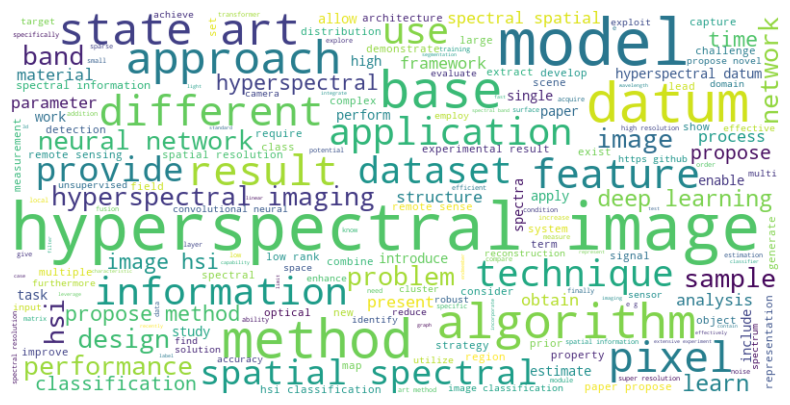

# Latest Trends of Research on Hyperspectral Imaging

This project visualizes the distribution of topics derived from an LDA (Latent Dirichlet Allocation) model. It includes three main components: data scraping, data preprocessing, and an interactive Streamlit app for topic visualization. The goal is to scrape data from relevant sources, preprocess it for LDA modeling, and present the results interactively.

## Table of Contents

Project Overview  
Project Structure  
Technologies Used  
Installation  
Usage  
Contribution  

## Project Overview

This project demonstrates the full pipeline of building a topic modeling application:

**Data Scraping:**  
The first step in the project involves collecting data from arXiv, a renowned open-access repository that hosts scholarly articles across a wide range of fields, including physics, mathematics, computer science, and more. By targeting metadata and abstracts related to **hyperspectral imaging**, we extracted structured data such as titles, authors, publication dates, and abstracts. This data serves as the foundation for further analysis. The scraping process was automated, iniscically set as every 3 months, using Python libraries, ensuring efficiency and reproducibility.  
  

**Data Preprocessing:**  
The scraped data underwent thorough preprocessing to ensure it was clean and suitable for topic modeling. Tasks included:

1. Removing stop words and irrelevant symbols.  
2. Tokenizing text into meaningful units (words or phrases).  
3. Lemmatizing words to reduce them to their base forms.  
4. Filtering terms based on domain-specific keywords to focus on hyperspectral imaging methods and applications.  
These tasks were implemented using spaCy, a robust natural language processing (NLP) library, which efficiently handled large datasets and performed advanced text processing.

**Topic Modeling and Analysis:**  
Once cleaned, the data was analyzed using topic modeling techniques such as Latent Dirichlet Allocation (LDA). Please note that 'sentence transformers' is also a very powerful tool, while because of the confilication of keras versions, LDA was used in this project. This helped identify the most prevalent topics within the domain of hyperspectral imaging. Each topic was represented by a set of keywords and associated weights, offering insights into the primary research areas and trends. The modeling process also allowed for tuning parameters like the number of topics to optimize the results.

**Interactive Visualization:**  
Creating a Streamlit app that provides a pie chart visualization of the topic distribution.

The final product is an interactive web-based app where users can explore most used key topic distributions, weights, and relevant keywords for each topic.

## Project Structure

├── requirements.txt  
├── script_test.ipynb  
├── data scraping.py        
├── data preprocess.py    
├── streamlit.py   
└── README.md                 

## Technologies Used

Python: Core language used for all stages of the project.  
xml.etree.ElementTree: For data scraping from websites.  
spaCy: For advanced text preprocessing and NLP tasks.  
Plotly: For creating interactive visualizations.  
Streamlit: For building the web application.  
Pandas: For data manipulation and analysis.  
datetime: managing and manipulating date and time values.   

## Installation

To run this project, follow the steps below:

1. Clone this repository:  
git clone git@github.com:EmmaSHANG0625/Capstone-Challenge---Latest-Trends-of-Research-on-Hyperspectral-Imaging.git

2. Install the required dependencies:
Install libraries manually  

3. Set up spaCy models (used for preprocessing):  
python -m spacy download en_core_web_sm

## Usage

1. Data Scraping:
Run the following script to scrape data from your desired source (e.g., arXiv):  
python data scraping.py  
This will save the scraped data to the directory. Use the python schedule for automated data scraping every 3 months. 

2. Data Preprocessing:
Use the preprocessing script to clean and prepare the scraped data for LDA modeling:
python data preprocessing.py  
This will generate a processed dataset suitable for LDA.

3. Streamlit App:
Run the Streamlit app to visualize the LDA topics:
streamlit run streamlit.py  
This will open a local server at [streamlit app](https://emmashang0625-capstone-challenge---latest-tren-streamlit-jldhly.streamlit.app/), where you can interact with the topic distribution pie chart.

## Contribution
The whole project, including data scriping, preprocessing, model evaluation and Streamlit app development, was completed by Hui Shang. Contributions and improvements to the project are welcome!
